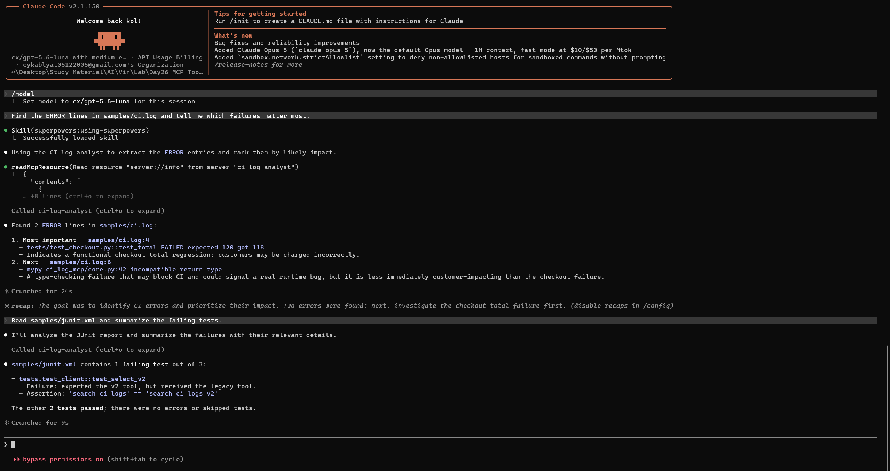

# Manual Claude Code Evidence

This directory stores the manual Claude Code verification required to demonstrate that the MCP server can be discovered and used from natural-language requests.

## Screenshot

Upload the screenshot to this directory with the exact filename:

```text
claude-code-mcp-verification.png
```

Expected final path:

```text
04-lab/ci-log-mcp/evidence/claude-code-mcp-verification.png
```

Once that file is uploaded, it will render automatically below:



## What the screenshot verifies

- Claude Code is running in the Day26 project.
- Claude Code uses the `ci-log-analyst` MCP server from a natural-language request.
- Claude Code reads the `server://info` MCP resource.
- A CI-log request returns real ERROR entries from `samples/ci.log`.
- A JUnit request returns the real failing-test information from `samples/junit.xml`.
- The user does not need to explicitly instruct Claude Code to call a specific MCP tool by name.

No credential, token, API key, password, private key, or `.env` content should appear in this directory.
